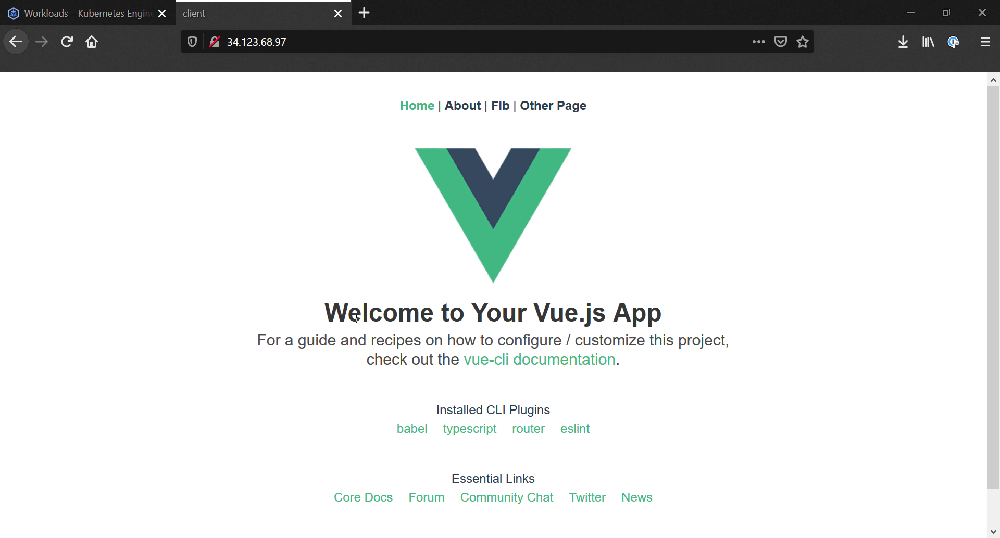

This repository will be going through how to develop & deploy a Kubernetes cluster to Google Cloud. The full write up is available over on: <https://github.com/JackMcKew/jackmckew.dev/blob/main/drafts/2020/develop-with-kubernetes/develop-with-kubernetes.md>

Our application (albeit basic) will allow users to input a number which will correspond to the index in the Fibonacci sequence, and our application will respond with the computed number. Redis will store this number locally to give users a list of recently requested indexes, and PostgreSQL will store the input and output. More specifically we will be using the following technologies:

| Technology     | Use                                                                          |
| -------------- | ---------------------------------------------------------------------------- |
| Docker         | Docker will be used to containerization of the services inside our app       |
| Google Cloud   | The cloud provider will be using to host our Kubernetes Cluster              |
| Vue            | Vue is the front-end JavaScript framework that we will use                   |
| Express        | Express is responsible for the API between Redis, PostgreSQL and Vue         |
| Redis          | Redis will store/retrieve any local data used by our users                   |
| PostgreSQL     | PostgreSQL will be our database                                              |
| Nginx          | Nginx will handle the routing between our services                           |
| Github Actions | Github Actions will be our CI/CD platform for running tests before deploying |

